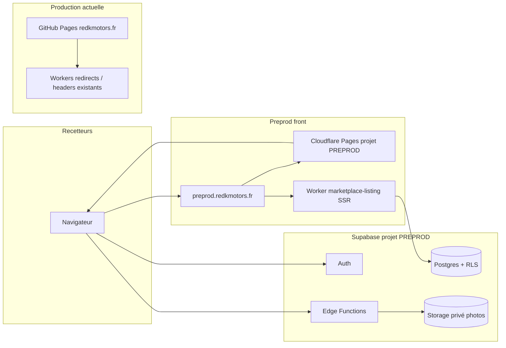

# Proposition — préproduction isolée `preprod.redkmotors.fr`

**Statut : document de décision — rien n’est activé** (pas de DNS, pas de projet Supabase, pas d’abonnement, pas de déploiement).  
Point de reprise code : **`95cb499`**. Architecture **cible production** inchangée : **https://redkmotors.fr/achat-revente/** sur le site vitrine actuel.

---

## 1. Manipulations manuelles restantes (local)

Voir **`RECETTE_QUALIFICATION.md`** :

1. **Trois vraies photos** via le bouton « Ajouter des photos » (picker natif).
2. **Valider** une annonce **dépôt-vente** depuis le panel modération (pas d’API).

---

## 2. Architecture recommandée

### Vue d’ensemble



| Composant | Préproduction (proposé) | Production (existant / cible) |
|-----------|-------------------------|-------------------------------|
| **Domaine vitrine** | `preprod.redkmotors.fr` (sous réserve DNS) | **`redkmotors.fr`** (sans tiret) |
| **Hébergement HTML statique** | **Cloudflare Pages** — **nouveau** projet, branche ou CI dédiée, artefact `_site` | **GitHub Pages** (inchangé) |
| **Routes marketplace** | Même chemins relatifs : `/achat-revente/`, `/achat-revente/vehicules/`, etc. | **`/achat-revente/`** sous la racine du domaine |
| **Fiches annonce HTML** | Worker **`marketplace-listing`** sur la zone DNS `preprod.redkmotors.fr` : route `preprod.redkmotors.fr/achat-revente/vehicules/*` **avant** l’origine Pages | Même Worker sur `redkmotors.fr/achat-revente/vehicules/*` au go-live marketplace (non déployé aujourd’hui) |
| **Catalogue JS (filtres)** | Pages statiques Eleventy + bundle `marketplace.bundle.js` | Idem |
| **Backend** | Projet Supabase **séparé** (ref dédiée, jamais la prod) | Projet Supabase **prod** distinct plus tard |
| **Edge Functions distantes** | `supabase functions deploy …` lié au projet préprod (voir ci-dessous) | Déploiement séparé vers projet prod |
| **Edge Functions locales** | `npx supabase functions serve` — **dev Docker uniquement**, pas un déploiement | N/A |

Cloudflare Pages est une **option d’hébergement préprod distincte** : la prod reste sur GitHub Pages ; on n’« upgrade » pas GH Pages vers CF Pages pour le domaine principal dans cette proposition.

### Intégration Worker SSR

- Code : `workers/marketplace-listing/` (déjà prévu dans `LISTING_PAGES.md`).
- **Préprod** : route Cloudflare `preprod.redkmotors.fr/achat-revente/vehicules/*` → Worker avec secrets **`SUPABASE_URL`** + **`SUPABASE_ANON_KEY`** du projet **préprod**, `MARKETPLACE_ALLOW_INDEX=0`.
- **Prod future** : route identique sur `redkmotors.fr/achat-revente/vehicules/*`, secrets **prod**.
- Le Worker appelle la RPC `get_public_listing_by_slug` ; HTML `Cache-Control: public, max-age=60` ; 404 `no-store` si annonce absente.
- Les **images** dans le HTML pointent vers `https://<ref-preprod>.supabase.co/functions/v1/serve-listing-photo?...` — **hors** domaine `preprod.redkmotors.fr` (important pour la protection d’accès).

### Supabase préprod (projet séparé)

1. Créer projet (région EU recommandée, proche utilisateurs FR).
2. `supabase link` + `supabase db push` (migrations `marketplace/supabase/migrations/`).
3. Déployer les fonctions (CLI, depuis `marketplace/`) :
   - `process-listing-photo`
   - `serve-listing-photo`
   - `moderate-listing`
   - `admin-export`
   - `bootstrap-admin` (ponctuel, puis retirer l’accès)
4. Configurer secrets projet (dashboard Supabase → Edge Functions) : `SUPABASE_SERVICE_ROLE_KEY`, variables internes si requises par le code.
5. Bootstrap rôles admin / comptes recette **préprod** (`ADMIN_BOOTSTRAP.md`) — emails dédiés (ex. `@recette.redkmotors.fr`), **pas** les `@test.local` locaux.

**Local vs distant** : `supabase functions serve --env-file .env.local` sert uniquement la stack locale. Toute préprod/prod exige **`supabase functions deploy <nom> --project-ref <ref-preprod>`** (ou pipeline CI équivalent).

### URLs Auth (confirmation email, reset mot de passe)

Dans Supabase Auth → **URL Configuration** (projet **préprod**) :

| Réglage | Valeur proposée |
|---------|-----------------|
| **Site URL** | `https://preprod.redkmotors.fr/` |
| **Redirect URLs** (allowlist) | `https://preprod.redkmotors.fr/**`, `http://localhost:8083/**` (debug local optionnel), chemins callback marketplace si utilisés (`/achat-revente/compte/`, etc.) |

Les liens **email** passent par `https://<ref-preprod>.supabase.co/auth/v1/verify?...&redirect_to=https://preprod.redkmotors.fr/...` — **ne pas** bloquer le host `*.supabase.co`.

Provider email préprod : SMTP de test (Resend sandbox, Mailtrap, ou SMTP Supabase avec domaine de test) — **pas** les boîtes clients.

### Protection d’accès (mécanisme retenu — pas un vague « basic auth »)

**Recommandation : Cloudflare Zero Trust (Access)** sur le hostname **`preprod.redkmotors.fr` uniquement** :

- **Application Access** : politique « Allow » pour emails recette (@… listés) ou IdP ; **Bypass** pour les bots de CI smoke (token service, IP fixe atelier) si besoin.
- **Ne pas** appliquer Access sur `*.supabase.co` : Auth, Edge Functions et photos restent joignables pour les utilisateurs **déjà authentifiés** sur le site (session Supabase + JWT).
- **Workers SSR** : exécutés sur le même hostname ; Access s’applique avant le Worker → les recetteurs se connectent une fois, puis SSR + static passent.
- **Images** : chargées depuis Supabase Functions (domaine différent) → **non bloquées** par Access sur preprod ; RLS + logique `serve-listing-photo` assurent qu’une photo publiée n’est servie que si l’annonce est `published`.

**Alternative** (si Zero Trust indisponible) : **Cloudflare Workers** « gate » léger sur `preprod.redkmotors.fr` (cookie signé + formulaire mot de passe unique stocké en secret Worker) — plus fragile, à documenter séparément.

**Non retenu pour préprod** : HTTP Basic Auth natif GitHub Pages (non supporté sur GH Pages seul) ; Basic Auth Cloudflare **sans** Access n’est pas un produit unique — Access ou Worker custom est le mécanisme explicite.

`noindex` sur marketplace préprod : **oui**, en complément (pas substitut à Access).

### Permissions API et photos

| Surface | Qui | Mécanisme |
|---------|-----|-----------|
| PostgREST / RPC | Utilisateur connecté | JWT + **RLS** |
| `process-listing-photo` | Vendeur propriétaire | JWT + vérif côté fonction |
| `serve-listing-photo` | Public (anon) | Annonce publiée + `listing_public_photos` ; pas de bucket public direct |
| `moderate-listing` | Modérateur / admin | JWT + rôle |
| Storage | Service role uniquement (functions) | Pas d’upload client direct bucket |

Clé **anon** préprod : injectée au **build** Eleventy (publique par design) ; **service role** : secrets Supabase + CI uniquement, jamais dans `_site`.

### Secrets et emplacement

| Secret | Où |
|--------|-----|
| `MARKETPLACE_PREPROD_SUPABASE_URL` / anon key | GitHub Actions **secrets** (workflow build préprod) ; Cloudflare Pages env **Preview/Production** pour projet préprod |
| `SUPABASE_SERVICE_ROLE_KEY` (préprod) | Supabase dashboard ; CI déploiement functions ; **pas** front |
| Worker `SUPABASE_URL`, `SUPABASE_ANON_KEY` | Cloudflare Worker secrets (préprod vs prod séparés) |
| `MARKETPLACE_PREPROD_ALLOW_RUN` | Machine développeur / CI smoke uniquement |
| Comptes recette préprod | Gestionnaire mots de passe ; mots de passe **≠** local `TestMarketplace-Local-2026!` |

Fichier exemple local (gitignored) possible : `.env.preprod.local` — **ne jamais committer**.

---

## 3. Retrait public — délais et limites (sans sur-promesse)

| Ressource | Comportement après retrait / dépublication | Délai **typique** max côté infra configurée |
|-----------|--------------------------------------------|-----------------------------------------------|
| **Photo** (`serve-listing-photo`) | HTTP **404** + `Cache-Control: no-store` | Copies déjà en cache : jusqu’à **~60 s** (`max-age=60` sur les 200 historiques) |
| **Fiche HTML Worker** | **404** + `no-store` | Idem **~60 s** si un 200 HTML était en cache |
| **Catalogue JS** | Annonce disparaît des requêtes `listings_public` immédiatement en base | UI après refresh ; pas de TTL long sur API |

**Limites réelles** :

- Une image **déjà téléchargée** ou copiée par un visiteur **ne peut pas être « effacée »** côté serveur.
- Un CDN ou proxy **peut** conserver une réponse 200 plus longtemps si un TTL custom a été appliqué ailleurs — la config **actuelle** du repo vise 60 s, **sans purge manuelle** pour chaque retrait ordinaire.
- Purge CDN **ponctuelle** : réservée incident / urgence légale, pas le flux nominal (`PREPRODUCTION.md`, `PHOTOS.md`).

Préprod doit reproduire **les mêmes en-têtes cache** que la prod pour valider ce comportement.

---

## 4. Tests : local vs préprod

| Commande | Cible | Reset / seed |
|----------|--------|--------------|
| `npm run test:marketplace:local` | **localhost / 127.0.0.1** uniquement | **Oui** (reset + seed) — **interdit** contre préprod |
| `npm run test:marketplace:e2e` | Local | Non (mais comptes seed locaux requis) |
| **`npm run test:marketplace:preprod`** | Projet Supabase **préprod autorisé** | **Non** ; nettoyage = `withdraw_listing` sur annonce `[preprod-smoke]` |

Variables pour **`test:marketplace:preprod`** :

```bash
MARKETPLACE_PREPROD_ALLOW_RUN=preprod-redkmotors-smoke
MARKETPLACE_PREPROD_ALLOWED_PROJECT_REF=<ref-projet-preprod>
MARKETPLACE_PREPROD_SUPABASE_URL=https://<ref>.supabase.co
MARKETPLACE_PREPROD_ANON_KEY=<anon-preprod>
MARKETPLACE_PRODUCTION_SUPABASE_PROJECT_REF=<ref-prod-future>   # garde-fou
MARKETPLACE_PREPROD_SITE_URL=https://preprod.redkmotors.fr/     # optionnel, vérifie hôte ≠ prod
MARKETPLACE_PREPROD_TEST_VENDOR_EMAIL=...
MARKETPLACE_PREPROD_TEST_MODERATOR_EMAIL=...
MARKETPLACE_PREPROD_TEST_PASSWORD=...
```

Le script **refuse** localhost et refuse si `ALLOWED_PROJECT_REF` ≠ ref extraite de l’URL.

---

## 5. Accès et coûts (vérification octobre 2026 — à reconfirmer avant engagement)

| Service | Usage préprod | Ordre de grandeur |
|---------|---------------|-------------------|
| **GitHub Pages** | Prod vitrine **inchangée** | Gratuit (repo public/privé selon plan GH) |
| **Cloudflare Pages** | **Nouveau** projet préprod | Gratuit tier (builds/mois limités — voir [developers.cloudflare.com/pages/platform/limits](https://developers.cloudflare.com/pages/platform/limits)) |
| **Cloudflare Workers** | SSR fiches + redirects existants prod | Free tier : 100k req/j **gratuit** ; préprod faible trafic |
| **Cloudflare Zero Trust Access** | Protection `preprod.redkmotors.fr` | Plan Free : jusqu’à **50 utilisateurs** Access — suffisant recette ; au-delà, voir grille Zero Trust |
| **Supabase** | Projet préprod dédié | Free tier : 500 Mo DB, 1 Go storage, egress limité — **surveiller** volume photos test ; upgrade Pro si dépassement |
| **Email (SMTP test)** | Auth + notifications | Mailtrap / Resend free tier ou coût faible selon volume |

Aucun montant garanti — **revalider les grilles officielles** au moment de votre « go ».

---

## 6. Actions exactes que votre accord autoriserait

Sans exécution tant que vous n’avez pas validé :

1. **DNS** : enregistrement `CNAME preprod` → cible Cloudflare Pages (ou proxy CF) — **vérifier disponibilité** du sous-domaine.
2. **Supabase** : création projet **preprod-redkmotors** (nom interne), migrations, deploy functions, Auth URLs, SMTP test.
3. **Cloudflare** : projet Pages préprod, variables build, route Worker `marketplace-listing` sur `preprod.redkmotors.fr/achat-revente/vehicules/*`, politique **Access** + liste emails recette.
4. **GitHub** : workflow (ou manuel) build Eleventy `marketplace.enabled: true` avec secrets préprod → deploy branch → Pages préprod.
5. **Comptes** : bootstrap admin + 2 vendeurs + 1 mod + 1 staff **préprod** ; mots de passe forts stockés coffre.
6. **Smoke** : `npm run test:marketplace:preprod` depuis poste ou CI **après** (1–5).
7. **Recette humaine** : checklist `RECETTE_QUALIFICATION.md` sur préprod (picker photos + Valider dépôt-vente).

**Explicitement hors scope sans nouvel accord** : projet Supabase **production** marketplace, routes SSR sur **redkmotors.fr**, ouverture publique, indexation (`MARKETPLACE_ALLOW_INDEX=1`).

---

## Documents liés

- `PREPRODUCTION.md` — principes et checklist
- `RECETTE_QUALIFICATION.md` — limites recette locale + manuel
- `LOCAL_VALIDATION.md` — orchestrateur local (reset)
- `LISTING_PAGES.md` — Worker SSR prod cible
